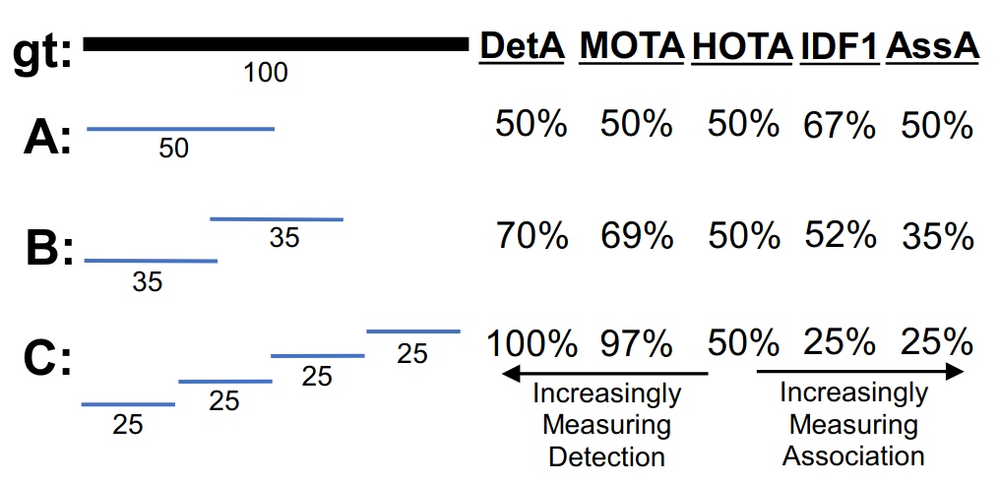

# ✒️ 论文公式总结

## 目录

| 公式名 | 详情 |
| ----- | ----- |
| GIoU | [详情](#GIoU) |
| L2 distance | [详情](#L2-distance) |
| Kalman Filter | [详情](#kf) |
| Extended Kalman Filter | [详情](#ekf) |
| HOTA | [详情](#hota) |

### GIoU

$GIoU = IoU_{3d} - \frac{V_c - U}{V_c}$

其中，$V_c$代表能够包含两个框的最小立方体体积。$U$代表两个检测框的交集体积。

### L2 distance
L2距离是简单的欧几里得距离。

$D_{\text{L2}}(\mathbf{x}, \mathbf{y}) = \sqrt{\sum_{i=1}^n (x_i - y_i)^2}$

### Kalman Filter
Kalman滤波器是一种用于预测和估计动态系统的状态的滤波方法。下面是它在MOT中的常见形式。（CV/CA模型）

$$
\begin{align*}
x_{\text{pre}} &= A \cdot x \\
P_{\text{pre}} &= A \cdot P \cdot A^T + Q \\
K_k &= P_{\text{pre}} \cdot H^T / (H \cdot P_{\text{pre}} \cdot H^T + R) \\
x &= x_{\text{pre}} + K_k \cdot (z - H \cdot x_{\text{pre}}) \\
P &= (I - K_k \cdot H) \cdot P_{\text{pre}}
\end{align*}
$$

注意，filterpy库中的实现是略有不同的。对于最后一个公式，它进行了一定的修正。

### Extended Kalman Filter
扩展卡尔曼滤波器是基于普通卡尔曼滤波器的扩展，用于处理非线性系统。其原理是对模型进行泰勒一阶展开，从而处理非线性系统。下面是对常用非线性模型CTRV的扩展卡尔曼滤波器的数学公式。

$$
\begin{align*}
x_{pre} &=
\begin{bmatrix} 
x_{pre} \\ y_{pre} \\ v_{pre} \\ \theta_{pre} \\ \omega_{pre} 
\end{bmatrix} = 
x + 
\begin{bmatrix} 
\frac{v}{\omega} \left( \sin(\omega \cdot \text{dt} + \theta) - \sin(\theta) \right) \\
\frac{v}{\omega} \left( \cos(\theta) - \cos(\omega \cdot \text{dt} + \theta) \right) \\
0 \\
\omega \cdot \text{dt} \\
0
\end{bmatrix} \\
P_{\text{pre}} &= J \cdot P \cdot J^T + Q \\
K_k &= P_{\text{pre}} \cdot J_h^T / (J_h \cdot P_{\text{pre}} \cdot J_h^T + R) \\
x &= x_{\text{pre}} + K_k \cdot (z - h(x_{\text{pre}})) \\
P &= (I - K_k \cdot J_h) \cdot P_{\text{pre}}
\end{align*}
$$

### HOTA: A Higher Order Metric for Evaluating Multi-object Tracking

HOTA可以被视为三个IoU得分的组合。它将跟踪评估任务分为三个子任务（检测、关联和定位），并使用IoU（交并比）公式（也称为杰卡德指数）为每个子任务计算得分。

1. 定位： 用于衡量追踪框和真实框之间的重合程度

$$LocIOU = \frac{Intersection}{Union}$$

$$LocA = \frac{1}{|TP|} \sum_{c \in TP} \mathrm{Loc-IoU}(c)$$

2. 检测： 衡量所有预测检测集合与所有真实检测集合之间的对齐程度

$$\mathrm{DetA} = \frac{|TP|}{|TP| + |FN| + |FP|}$$

3. 关联： 衡量预测关联集合与真实关联集合之间的对齐程度

$$\mathrm{AssA} = \frac{1}{|TP|} \sum_{c \in TP} \mathrm{Ass-IoU}(c) = \frac{1}{|TP|} \sum_{c \in TP} \frac{|TPA(c)|}{|TPA(c)| + |FNA(c)| + |FPA(c)|}
$$

最后综合考虑上面的三个方面，得到HOTA指标。（可能注意到没有LocA，因为这个指标内化在确定DetA和AssA中）
$$\mathrm{HOTA}_{\alpha} = \sqrt{\mathrm{DetA}_{\alpha} \cdot \mathrm{AssA}_{\alpha}}$$

__和其他指标的区别__
我们可以通过下面这个例子看到，在HOTA中关联和检测的权重几乎相同，而不是想MOTA中那样，检测的权重明显更高。我认为这是非常合理的。

