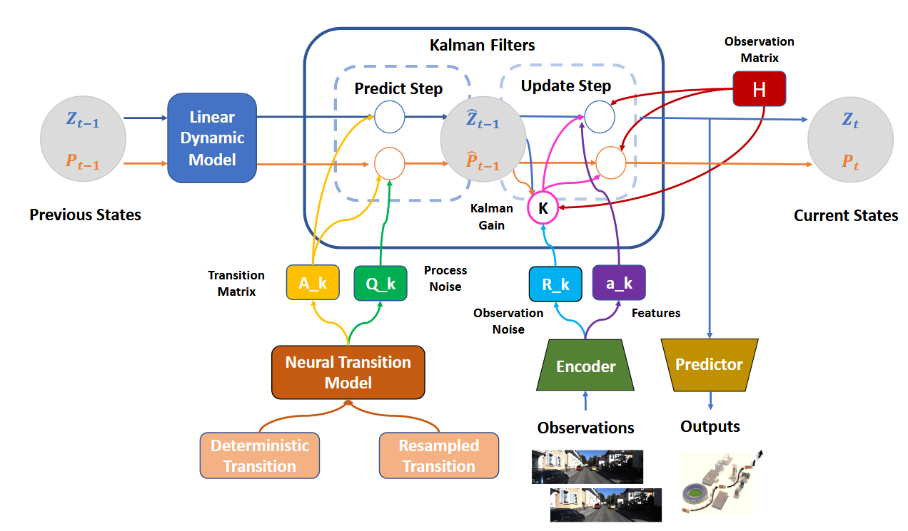

# 📚 其他论文总结

## 目录表格
|       简称        | 发表信息 | 核心贡献描述                     | 具体信息 |  其他   |
|----------------------|--------------|----------------------------------|-------------|------|
| Dynanet      | TNNLS2021 | kalman引入神经网络       | [查看](#dynanet) | - |

## DynaNet: Neural Kalman Dynamical Model for Motion Estimation and Prediction
### 🌟 基本信息
- 开源地址：不开源，但是通过关系要到源码了
- 发表信息：IEEE Transactions on Neural Networks and Learning Systems ( Volume: 32, Issue: 12, December 2021)

### 🎯 核心内容
- 将卡尔曼滤波扩展到神经网络，一方面有效果，还有一定的理论依据。

### 💡 学习收获

### 😃 其他  
- 陈老师直接给了源码😋，但是一直没复现被批好几回😭