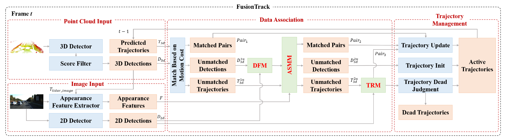

# 📚 多目标追踪论文总结

## 目录表格
|       简称        | 发表信息 | 核心贡献描述                     | 具体信息 | 传感器       |  其他   |
|----------------------|--------------|----------------------------------|----------|--------------|------|
| SORT      | ICIP2016 | TBD框架的开创论文       | [查看](#sort) | camera | - |
| DeepSORT      | ICIP2017 | 首个引入外貌特征的MOT       | [查看](#deepsort) | camera | - |
| AB3DMOT      | IROS2020 | 将TBD带入3D追踪邻域       | [查看](#ab3dmot) | LiDAR | 待细看 |
| EagerMOT      | IRCA2021 | 首个将相机激光雷达融合的TBD框架       | [查看](#eagermot) | LiDAR+camera | - |
| DeepFusionMOT      | RAL2022 | 提出4阶段的数据关联       | [查看](#deepfusionmot) | LiDAR+camera | - |
| ys_tracker      | TITS2022 | 为激光引入检测置信度，添加激光特特征       | [查看](#ys_tracker) | LiDAR | - |
| simpletrack      | ECCV2022 | 全面总结TBD的问题       | [查看](#simpletrack) | LiDAR | - |
| ByteTrack      | ECCV2022 | 引入二阶段的数据关联       | [查看](#bytetrack) | camera | - |
| MOTR      | ECCV2022 | 首个E2EMOT       | [查看]() | camera | - |
| StrongSORT      | TM2023 | Deepsort现代版，两个新机制       | [查看]() | camera | - |
| DFRFast      | ICRA2023 | C++又快又好       | [查看](#dfr) | LiDAR+camera | - |
| MOTRv2      | CVPR2023 | E2E+TBD，改进了E2E效果       | [查看]() | camera | - |
| Fusiontrack      | IROS2024 | 融合方法+提点模块      | [查看](#fusiontrack) | LiDAR+camera | - |
| DiffMOT      | CVPR2024 | 采用扩散模型来进行非线性运动预测       | [查看]() | camera | - |
| Co-MOT      | TITS2024 | 提出改进的GNN进行运动建模-。未开源       | [查看]() | LiDAR | - |
| FastPOLY      | RAL2024 | 仔细考虑运动模型的构建CTRV，引入旋亲和度-       | [查看]() | LiDAR | - |
| FastTrack      | IJCV2024 | 并行卡尔曼滤波-       | [查看]() | camera | - |
| MMTracker      | AAAI2025 | ?       | [查看]() | camera | - |
| MambaTrack      | ACMMM2025 | 引入Mamba模型取代KF       | [查看](#mambatrack) | camera | - |
| MCTrack      | Arxiv2025 | 效果最好的开源追踪器       | [查看]() | LiDAR+camera | - |
| ERMOT      | TII2025 | 一种更新策略，未开源       | [查看]() | camera | - |
| MMFJDT      | RAL2025 | 检测追踪融合框架，效果似乎不太好       | [查看]() | LiDAR+camera | - |
| sambamotr   | ICLR2025  |  mamba结构的E2EMOT    | [查看]() | camera | - |

## Simple online and realtime tracking
### 🌟 基本信息
- 开源地址：https://github.com/abewley/sort
- 发表信息：2016 IEEE international conference on image processing (ICIP)

### 🎯 核心内容
- 提出了“基于检测的追踪”框架，在准确度和实时性上都比传统方法更好，是后面工作的基础。

### 💡 学习收获
- 使用的是kalman滤波进行状态估计，匈牙利算法进行匹配，距离函数使用的是IOU。

## Simple online and realtime tracking with a deep association metric
### 🌟 基本信息
- 开源地址：https://github.com/HowieMa/DeepSORT_YOLOv5_Pytorch
- 发表信息：2017 IEEE international conference on image processing (ICIP)

### 🎯 核心内容
- 在SORT的基础上，增加了外貌特征网络，准确性得到了大大的提高。

## 3d multi-object tracking: A baseline and new evaluation metrics
### 🌟 基本信息
- 开源地址：https://github.com/xinshuoweng/AB3DMOT
- 发表信息：2020 IEEE/RSJ International Conference on Intelligent Robots and Systems (IROS)

### 🎯 核心内容
- 将TBD框架应用到LiDAR的MOT任务上。

## EagerMOT: 3D Multi-Object Tracking via Sensor Fusion
### 🌟 基本信息
- 开源地址：https://github.com/aleksandrkim61/EagerMOT
- 发表信息：2021 IEEE International Conference on Robotics and Automation (ICRA)

### 🎯 核心内容
- 将TBD框架应用到LiDAR和camera融合的MOT任务上。
- 其融合框架的想法是：camera用来平滑远处的目标，而LiDAR用来精确跟踪近处的目标。

### 🤔 提出问题
- 遮挡情况导致的FP、FN
- 融合方法使用复杂的特征提取，计算开销大。
    - 主要还是因为引入了额外的特征提取器。不过可以通过直接使用检测器的backbone来代替(ys_tracker)。
- 没有充分利用两种传感器的信息，主要是视觉。造成的原因是激光范围太小。

### 💡 学习收获
- 可以说是第一个完整的多传感器融合的MOT框架。结构经典很清晰，后续工作可以在此基础上改进。

##  DeepFusionMOT: A 3D Multi-Object Tracking Framework Based on Camera-LiDAR Fusion With Deep Association

### 🌟 基本信息
- 开源地址：https://github.com/wangxiyang2022/DeepFusionMOT
- 发表信息：IEEE Robotics and Automation Letters 2022

### 🎯 核心内容
- 提出了一个四阶段的数据关联方法。
- 在轨迹管理阶段加了一点小微调，增加了一个状态。

### 💡 学习收获
- 代码很清晰，结构好。可以以此为基础继续代码上的改进。
- 创新点很简单，可以说是将eagermot的工作清晰化了。

## 3D Multi-Object Tracking in Point Clouds Based on Prediction Confidence-Guided Data Association

### 🌟 基本信息
- 开源地址：https://github.com/hailanyi/3D-Multi-Object-Tracker
- 发表信息：IEEE Transactions on Intelligent Transportation Systems 2022

### 🎯 核心内容
- 提出了一个置信度网络来进行数据关联
- 置信度是一种仿卡尔曼滤波的结构，分更新和预测两个部分。内嵌到代价矩阵中，用贪婪算法来匹配。
- 采用了CA模型进行状态估计，在MCTrack中也提到CA的上限更高，不过具体效果还是看数据集。
- 直接使用backbone来进行特征提取，没有使用额外的特征提取器。

### 💡 学习收获
- 关于置信度设计，理论上感觉不太合理，但是效果得到实验证实，并且思路是对的。主要是体现这个置信度的方式感觉不合理。如果能像它论文途图那样更好。我认为可以考虑从噪声入手。

### 😃 其他   
- ys_tracker : 作者是原神哥

## Simpletrack: Understanding and rethinking 3d multi-object tracking
### 🌟 基本信息
- 开源地址：https://github.com/tusen-ai/SimpleTrack
- 发表信息：European conference on computer vision 2022

### 🎯 核心内容
- 

### 💡 学习收获
- 

## ByteTrack: Multi-Object Tracking by Associating Every Detection Box
### 🌟 基本信息
- 开源地址：https://github.com/ifzhang/ByteTrack
- 发表信息：European conference on computer vision 2022

### 🎯 核心内容
- 提出了一个二阶段的数据关联方法，根据检测结果的执行度进行两次匹配。结果证明提升效果非常明显

## DFR-FastMOT: Detection Failure Resistant Tracker for Fast Multi-Object Tracking Based on Sensor Fusion
### 🌟 基本信息
- 开源地址：
- 发表信息：

### 🎯 核心内容
- 

### 💡 学习收获 
- 

## FusionTrack: An Online 3D Multi-object Tracking Framework Based on Camera-LiDAR Fusion
### 🌟 基本信息
- 开源地址：https://github.com/zengwz/FusionTrack
- 发表信息：2024 IEEE/RSJ International Conference on Intelligent Robots and Systems (IROS)

### 🎯 核心内容
- 新的融合框架：利用了相机的外貌特征。数据关联也引入融合。
- 检测滤波模块(DFM)：针对误检的情况，过去的解决方法是多检测几帧才确认追踪，这引入了延迟问题。作者将未匹配的检测投影到2D进行检查，确认是否是误匹配。
- 外观相似度匹配模块(ASMM)：二阶段数据关联引入外貌特征进行匹配。之前是用GIoU进行匹配。这个部分作者还新建了一个特征提取网络
- 轨迹恢复模块(TRM)：针对漏检的目标，作者提出了这个模块。还是使用相机的检测结果来帮助3D检测。当轨迹的预测结果投影和相机重合度高，就认为这个预测是好的，保留并且作为3D的检测结果。

### 💡 学习收获 
- 注意到，本文使用了外貌特征。因此，作者也使用了EMA模块来更新外貌特征。
- 本文使用的是KF-CA模型。
- 本文非常适合作为对比目标。它是IROS24年结果，并且方法也很常规，指标不算特别高。

## MambaTrack: A Multi-Modal Multi-Object Tracking Framework with a Novel Kalman Filter
### 🌟 基本信息
- 开源地址：https://github.com/JackWoo0831/Mamba_Trackers (非官方实现)
- 发表信息：ACMMM 2025

### 🎯 核心内容
- 将Mamba模块引入追踪器，取代卡尔曼滤波器从而达到更好的非线性预测效果。

### 💡 学习收获 
- 该文章仅仅添加了Mamba模块，其它都使用的SORT基本框架。但是其效果非常好，说明Mamba模块确实有很好的效果。

### 🎨 TODO
- 实现Mamba模块，并添加到SORT中。
- 具体理解Mamba原理。