# 📚 多目标追踪论文总结

## 目录表格
|       简称        | 发表信息 | 核心贡献描述                     | 具体信息 | 传感器       |  其他   |
|----------------------|--------------|----------------------------------|----------|--------------|------|
| SORT      | ICIP2016 | TBD框架的开创论文       | [查看](#sort) | camera | - |
| DeepSORT      | ICIP2017 | 首个引入外貌特征的MOT       | [查看](#deepsort) | camera | - |
| AB3DMOT      | IROS2020 | 将TBD带入3D追踪邻域       | [查看](#ab3dmot) | LiDAR | 待细看 |
| CenterTrack | ECCV2020 | 转换为跟踪点 | [查看](#centertrack) | camera | - |
| JDE | ECCV2020 | JDE开创论文 | [查看](#jde) | camera | - |
| FairMOT      | IJCV2021 | JDE改进       | [查看](#fairmot) | camera | - |
| EagerMOT      | IRCA2021 | 首个将相机激光雷达融合的TBD框架       | [查看](#eagermot) | LiDAR+camera | - |
| JMODT | IROS2021 | 联合检测框架 | [查看](#jmodt) | LiDAR+camera | - |
| GIAOTrack | ICCVW2021 | NSA KF， EMA Bank | [查看](#giaotrack) | camera | Visdrone，offline |
| DeepFusionMOT      | RAL2022 | 提出4阶段的数据关联       | [查看](#deepfusionmot) | LiDAR+camera | - |
| ys_tracker      | TITS2022 | 为激光引入检测置信度，添加激光特特征       | [查看](#ys_tracker) | LiDAR | - |
| simpletrack      | ECCV2022 | 全面总结TBD的问题       | [查看](#simpletrack) | LiDAR | - |
| ByteTrack      | ECCV2022 | 引入二阶段的数据关联       | [查看](#bytetrack) | camera | - |
| MOTR      | ECCV2022 | 首个E2EMOT       | [查看](#motr) | camera | - |
| TrackFormer     | CVPR2022 | 基于Transformer的E2EMOT       | [查看](#trackformer) | camera | - |
| StrongSORT      | TM2023 | Deepsort现代版，两个新机制       | [查看](#strongsort) | camera | - |
| DFRFast      | ICRA2023 | C++又快又好       | [查看](#dfr) | LiDAR+camera | - |
| POLY-MOT   | IROS2023  | 不同类目标采用不同运动模型   | [查看](#ploymot) | LiDAR | - |
| MOTRv2      | CVPR2023 | E2E+TBD，改进了E2E效果       | [查看](#motrv2) | camera | - |
| OC-SORT      | CVPR2023 | 利用观测值来固定滤波误差       | [查看](#ocsort) | camera | - |
| ImprAsso | CVPR2023 | 改进的关联，匹配函数，遮挡初始化 | [查看](#ImprAsso) | camera | - |
| Fusiontrack      | IROS2024 | 融合方法+提点模块      | [查看](#fusiontrack) | LiDAR+camera | - |
| DiffMOT      | CVPR2024 | 采用扩散模型来进行非线性运动预测       | [查看](#diffmot) | camera | - |
| FastPOLY      | RAL2024 | 仔细考虑运动模型的构建CTRV，引入旋亲和度-       | [查看]() | LiDAR | - |
| FastTrack      | IJCV2024 | 并行卡尔曼滤波-       | [查看]() | camera | - |
| STT      | ICRA2024 | Transformer取代更多模块       | [查看](STT) | LiDAR | - |
| Co-MOT-tits      | TITS2025 | 提出改进的GNN进行运动建模-。未开源       | [查看](#Co-MOT-tits) | LiDAR | - |
| MMTracker      | AAAI2025 | ?       | [查看]() | camera | - |
| MambaTrack      | ACMMM2025 | 引入Mamba模型取代KF       | [查看](#mambatrack) | camera | - |
| MCTrack      | Arxiv2025 | 效果最好的开源追踪器       | [查看]() | LiDAR+camera | - |
| ERMOT      | TII2025 | 一种更新策略，未开源       | [查看]() | camera | - |
| MMFJDT      | RAL2025 | 检测追踪融合框架，效果似乎不太好       | [查看]() | LiDAR+camera | - |
| sambamotr   | ICLR2025  |  mamba结构的E2EMOT    | [查看]() | camera | - |
| DINOMOT | RAL2025  | 引入DINOv2特征提取模块 | [查看](#dinomot) | camera | - |
| HybridTrack | RAL 2025 | kf+数据驱动 | [查看](#hybridtrack) | LiDAR | - |
| RobMOT | TITS2025 | 针对检测器的kf+新的生命机制 | [查看](#robmot) | LiDAR | - |
| TrackTrack | CVPR2025 | 以轨迹为核心进行管理 | [查看](#tracktrack) | camera | - |
| LA-MORT | CVPR2025 | E2E，解决检测与关联竞争 | [查看](#la-mort) | camera | - |

## Simple online and realtime tracking
### 🌟 基本信息
- 开源地址：https://github.com/abewley/sort
- 发表信息：2016 IEEE international conference on image processing (ICIP)

### 🎯 核心内容
- 提出了“基于检测的追踪”框架，在准确度和实时性上都比传统方法更好，是后面工作的基础。

### 💡 学习收获
- 使用的是kalman滤波进行状态估计，匈牙利算法进行匹配，距离函数使用的是IOU。

## Simple online and realtime tracking with a deep association metric
### 🌟 基本信息
- 开源地址：https://github.com/HowieMa/DeepSORT_YOLOv5_Pytorch
- 发表信息：2017 IEEE international conference on image processing (ICIP)

### 🎯 核心内容
- 在SORT的基础上，增加了外貌特征网络，准确性得到了大大的提高。

## 3d multi-object tracking: A baseline and new evaluation metrics
### 🌟 基本信息
- 开源地址：https://github.com/xinshuoweng/AB3DMOT
- 发表信息：2020 IEEE/RSJ International Conference on Intelligent Robots and Systems (IROS)

### 🎯 核心内容
- 将TBD框架应用到LiDAR的MOT任务上。

## Tracking Objects as Points
### 🌟 基本信息
- 开源地址：https://github.com/xingyizhou/CenterTrack
- 发表信息：2020 European conference on computer vision (ECCV)

### 🎯 核心内容
- 核心思想：把跟踪简化为“跟踪中心点”的问题。把每个目标表示为一个 2D 中心点（object center），并在两帧间预测中心位移（offset）来进行关联。
- 输入：当前帧 + 前一帧 + 上一帧跟踪中心点热力图（heatmap）
- 基于 CenterNet 的检测头：中心点热力图 + 尺寸回归 + 偏移回归
- Offset-based 简单贪心关联（Tracking-by-Offset）

## Towards Real-Time Multi-Object Tracking
### 🌟 基本信息
- 开源地址：https://github.com/Zhongdao/Towards-Realtime-MOT
- 发表信息：2020 European conference on computer vision (ECCV)
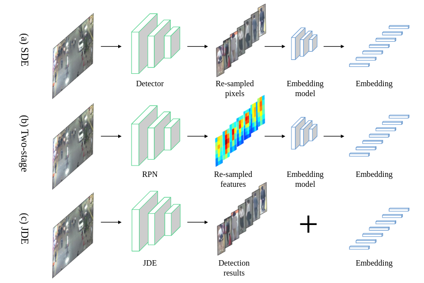

### 🎯 核心内容
- 提出了首个联合检测和嵌入（REID）的框架，将检测和特征提取集成到一个网络中，提高了多目标追踪的实时性。
- 单模型多任务学习：检测 + Embedding 同时输出
- 多任务损失 + 自动损失权重学习
- Embedding 学习采用 Cross-Entropy 而非 Triplet Loss

## FairMOT: On the Fairness of Detection and Re-Identification in Multiple Object Tracking
### 🌟 基本信息
- 开源地址：https://github.com/ifzhang/FairMOT
- 发表信息：2021 International journal of computer vision (IJCV)
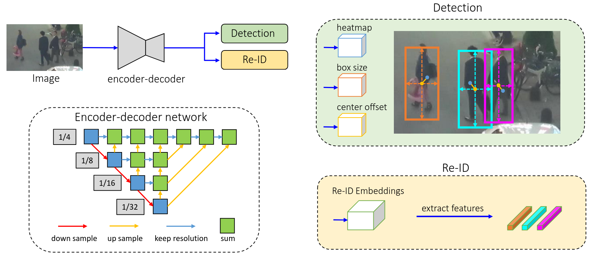

### 🎯 核心内容
作者指出，虽然单模型（one-shot）联合检测 + re-ID 的 MOT 框架在速度上有优势，但现有方法往往存在 “不公平性（unfairness）” —— 即检测任务被优先优化，而 re-ID 任务处在明显劣势，导致整体跟踪性能显著下降。

## EagerMOT: 3D Multi-Object Tracking via Sensor Fusion
### 🌟 基本信息
- 开源地址：https://github.com/aleksandrkim61/EagerMOT
- 发表信息：2021 IEEE International Conference on Robotics and Automation (ICRA)

### 🎯 核心内容
- 将TBD框架应用到LiDAR和camera融合的MOT任务上。
- 其融合框架的想法是：camera用来平滑远处的目标，而LiDAR用来精确跟踪近处的目标。

### 🤔 提出问题
- 遮挡情况导致的FP、FN
- 融合方法使用复杂的特征提取，计算开销大。
    - 主要还是因为引入了额外的特征提取器。不过可以通过直接使用检测器的backbone来代替(ys_tracker)。
- 没有充分利用两种传感器的信息，主要是视觉。造成的原因是激光范围太小。

### 💡 学习收获
- 可以说是第一个完整的多传感器融合的MOT框架。结构经典很清晰，后续工作可以在此基础上改进。

## Joint Multi-Object Detection and Tracking with Camera-LiDAR Fusion for Autonomous Driving
### 🌟 基本信息
- 开源地址：https://github.com/Kemo-Huang/JMODT
- 发表信息：2021 IEEE/RSJ International Conference on Intelligent Robots and Systems (IROS)

## GIAOTracker: A comprehensive framework for MCMOT with global information and optimizing strategies in VisDrone 2021
### 🌟 基本信息
- 开源地址：https://github.com/dyhBUPT/GIAOTracker
- 发表信息：2021 IEEE/CVF International Conference on Computer Vision Workshops (ICCVW)
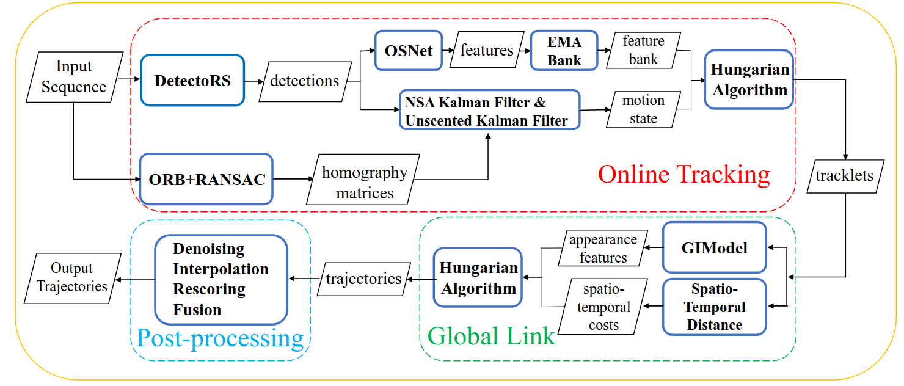

### 🎯 核心内容
- 整体是一个offline的追踪器，不过它有几个先进的模块值得学习。也是后面strongsort的基础。
- NSA KALMAN：说白了，就是自适应噪声的卡尔曼滤波器
- EMA BANK：EMA + BANK机制。EMA会考虑目标变化，而BANK则保存历史的外貌特征
- ORB+RANSAC： 由于是无人机数据集，作者对输入图像做了一些对齐变换。

##  DeepFusionMOT: A 3D Multi-Object Tracking Framework Based on Camera-LiDAR Fusion With Deep Association

### 🌟 基本信息
- 开源地址：https://github.com/wangxiyang2022/DeepFusionMOT
- 发表信息：IEEE Robotics and Automation Letters 2022

### 🎯 核心内容
- 提出了一个四阶段的数据关联方法。
- 在轨迹管理阶段加了一点小微调，增加了一个状态。

### 💡 学习收获
- 代码很清晰，结构好。可以以此为基础继续代码上的改进。
- 创新点很简单，可以说是将eagermot的工作清晰化了。

## 3D Multi-Object Tracking in Point Clouds Based on Prediction Confidence-Guided Data Association

### 🌟 基本信息
- 开源地址：https://github.com/hailanyi/3D-Multi-Object-Tracker
- 发表信息：IEEE Transactions on Intelligent Transportation Systems 2022
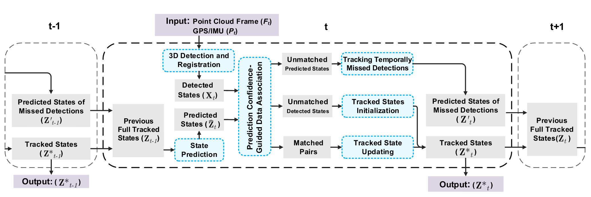

### 🎯 核心内容
- 提出了一个置信度网络来进行数据关联
- 置信度是一种仿卡尔曼滤波的结构，分更新和预测两个部分。内嵌到代价矩阵中，用贪婪算法来匹配。
- 采用了CA模型进行状态估计，在MCTrack中也提到CA的上限更高，不过具体效果还是看数据集。
- 直接使用backbone来进行特征提取，没有使用额外的特征提取器。

### 💡 学习收获
- 关于置信度设计，理论上感觉不太合理，但是效果得到实验证实，并且思路是对的。主要是体现这个置信度的方式感觉不合理。如果能像它论文途图那样更好。我认为可以考虑从噪声入手。

### 😃 其他   
- ys_tracker : 作者是原神哥

## Simpletrack: Understanding and rethinking 3d multi-object tracking
### 🌟 基本信息
- 开源地址：https://github.com/tusen-ai/SimpleTrack
- 发表信息：European conference on computer vision 2022
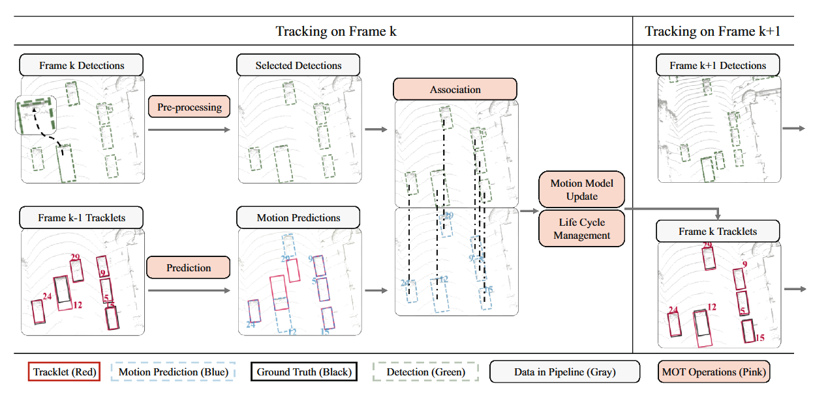

### 🎯 核心内容
- 作者充分分析了TBD框架的好坏。从检测、关联、运动模型和生命周期管理4个部分进行了深入的分析。
- 检测结果预处理：一般来说原生检测结果会非常多（提高AP），但是追踪器用往往只要很少一部分。旧方法使用阈值过滤来预处理。但是阈值设置鲁棒性差，可能会滤掉一些真实目标。作者的想法是采用严格阈值的NMS来替代。既去除检测器的重复，又避免误删。
- 数据关联方法：文章对比了匈牙利算法和贪婪算法。发现他们与距离函数的关系非常密切。IoU下两种方法差不多，距离函数下贪婪算法表现更好。
- 针对遮挡/稀疏点云问题。本文提出两个阶段的数据关联方法。类似ByteTrack，都是使用检测置信度来匹配。不同的是二阶段中，检测结果只用来关联，不参与状态更新，而是采用运动模型来预测新状态。

### 💡 学习收获
- IoU下两种方法差不多，距离函数下贪婪算法表现更好。这一点可以注意，如果之后要设计多种匹配的时候。
- 出现IDS的主要原因其实是由于轨迹的提前中断。论文中提到90%以上都是因为这个。而造成中断的无非就是遮挡和点云稀疏。
- 本文提到，Nuscenes数据集基准可能不太合理。静态车多，传感器频率低（2Hz），评价标准注重轨迹质量（还使用插值）。

## ByteTrack: Multi-Object Tracking by Associating Every Detection Box
### 🌟 基本信息
- 开源地址：https://github.com/ifzhang/ByteTrack
- 发表信息：European conference on computer vision 2022

### 🎯 核心内容
- 提出了一个二阶段的数据关联方法，根据检测结果的执行度进行两次匹配。结果证明提升效果非常明显

## MOTR: End-to-End Multiple-Object Tracking with Transformer
### 🌟 基本信息
- 开源地址：https://github.com/megvii-research/MOTR
- 发表信息：European conference on computer vision 2022
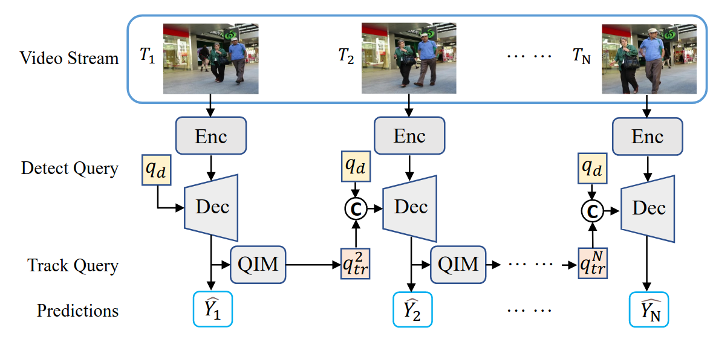

### 🎯 核心内容
- 提出了首个端到端的多目标追踪框架，正式将端到端方法引入MOT领域。
- 把 DETR 的 object query 扩展为具有时间维度的 track query，使同一查询在不同帧持续更新表示同一物体。

## TrackFormer: Multi-Object Tracking with Transformers
### 🌟 基本信息
- 开源地址：https://github.com/timmeinhardt/trackformer
- 发表信息：CVPR 2022
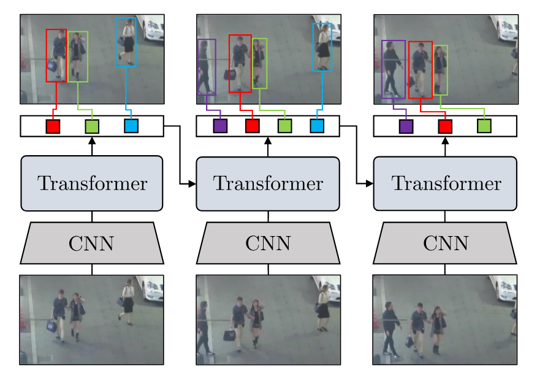

### 🎯 核心内容
- 提出了基于Transformer的端到端多目标追踪框架TrackFormer。新的框架，作者称之为“tracking-by-attention”。
- 直接用 Transformer decoder 的 attention 完成检测 + 关联的联合建模

## StrongSORT: Make DeepSORT Great Again
### 🌟 基本信息
- 开源地址：https://github.com/dyhBUPT/StrongSORT
- 发表信息：IEEE Transactions on Multimedia 2023

### 🎯 核心内容
- 如其名，StrongSORT就是Deepsort的加强版，在Deepsort的基础上，使用了最新的追踪机制，然后添加了两个新模块。
- AFLink： 解决同一目标被错误地分成多个 tracklets
- GSI： 解决检测器漏检导致轨迹断裂。通过使用高斯插值的方式进行平滑轨迹

## DFR-FastMOT: Detection Failure Resistant Tracker for Fast Multi-Object Tracking Based on Sensor Fusion
### 🌟 基本信息
- 开源地址：https://github.com/MohamedNagyMostafa/DFRFastMOT
- 发表信息：2023 IEEE International Conference on Robotics and Automation (ICRA)
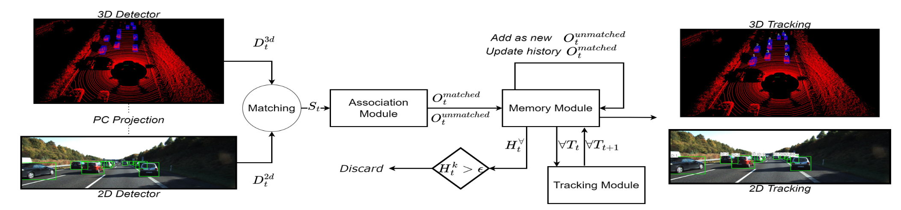

### 🎯 核心内容
- 首先是距离函数的使用，非常简单。相机用IOU，雷达用3D中心距离。然后设置两个阈值，接着设置参数占比来整合两种传感器的距离函数矩阵。
- 数据关联方法是介于匈牙利算法和贪婪算法之间。文中描述是：直接选择距离函数最好的进行匹配，直到阈值。因此，该算一个贪婪算法吧。
- 在3D状态也做2D的估计。

### 💡 学习收获 
- 采用的还是经典框架
- 这个方法很奇怪，基本没有什么大的变动，但是它效果却很好。
- 有一些简单的多传感器融合的地方，例如遗失帧取两种传感器的最小值。

## Poly-MOT: A Polyhedral Framework For 3D Multi-Object Tracking
### 🌟 基本信息
- 开源地址：https://github.com/lixiaoyu2000/Poly-MOT
- 发表信息：2023 IEEE/RSJ International Conference on Intelligent Robots and Systems (IROS)

### 🎯 核心内容
- 提出了两个运动模型：CTRA用于车辆等，Bicycle用于自行车等。

### 💡 学习收获 
- 他们实验室走的是传统模型路线，设计了非常精细的模型，并且配套复杂的处理机制，从而提高最终效果。

## MOTRv2: Bootstrapping End-to-End Multi-Object Tracking by Pretrained Object Detectors
### 🌟 基本信息
- 开源地址：https://github.com/megvii-research/MOTRv2
- 发表信息：2023 IEEE/CVF Conference on Computer Vision and Pattern Recognition (CVPR)
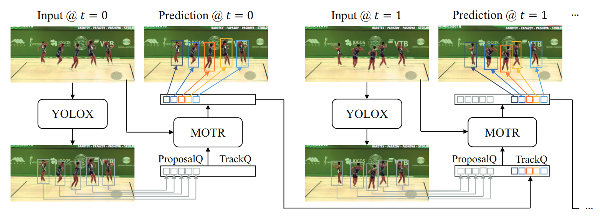

### 🎯 核心内容
- MOTR是第一个端到端的多目标追踪框架，但是效果并不好。MOTRv2通过分析，分为性能不好的主要原因是检测性能不好。于是，他们采取了一个类似与TBD的思路，提出了用一个预训练 YOLOX proposal 作为 anchor，引导 MOTR

## Observation-Centric SORT: Rethinking SORT for Robust Multi-Object Tracking
### 🌟 基本信息
- 开源地址：https://github.com/noahcao/OC_SORT
- 发表信息：2023 IEEE/CVF Conference on Computer Vision and Pattern Recognition (CVPR)
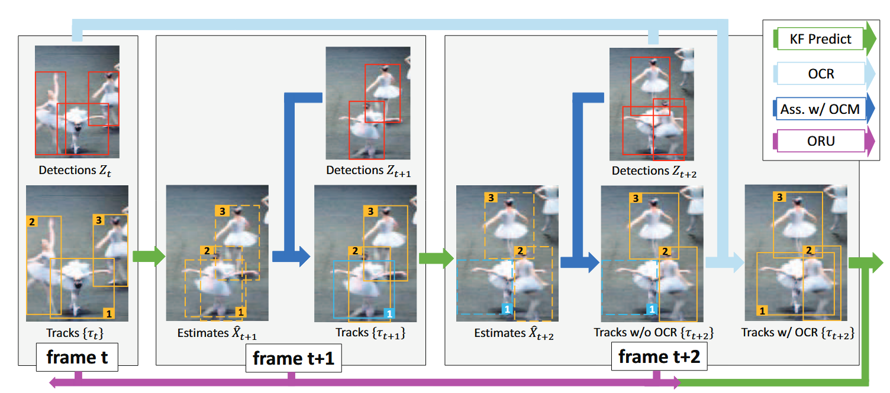

### 🎯 核心内容
- 提出SORT的三个问题：1. 依赖于高频检测以拟合线性运动。 2. 当目标丢失时，误差积累迅速（特别是速度）。 3. 现代检测器的状态方差比SORT估计出来的结果更小。
- 对于问题2，作者提出了一个新模块，'re-update'。当目标丢失再次被检测到时，激活这个模块。ORU
- 还设计了一个考虑方向的关联矩阵，考虑了目标运动方向。OCM
- 此外，还提出了一种启发式的改进模块，讲轨迹最后一次的观测值和检测值进行关联尝试。OCR

### 💡 学习收获 
- 文章推导出一个非常反直觉的结论：当$\delta_t$较小的时候，$\delta_t$越大两个时刻角度估计的误差越小。

## An Improved Association Pipeline for Multi-Person Tracking
### 🌟 基本信息
- 开源地址：未开源
- 发表信息：2023 IEEE/CVF Conference on Computer Vision and Pattern Recognition Workshops (CVPRW)

### 🎯 核心内容
- 组合匹配（Combined Matching, CM）
  - 这部分内容是针对BTYETRACK的改进。它说BYTE的方案有两个问题，未激活轨迹是无法和低置信度检测匹配的；总是高置信度检测先匹配，即使低置信度才是正确的。
  - 为此，作者提出了一个组合匹配手段。首先还是先做一个二阶段的匹配，但是这步主要是为了调试出阈值。然后根据这个阈值，计算出一个缩放因子（低置信度和高置信度的检测和轨迹之间的距离函数会乘这个因子）。直接concat得到一个单一的距离矩阵，然后做匈牙利匹配。
- 组合代价函数(Combined Distance, CD): 涉及了一个带权重的距离矩阵。包括马氏距离，外貌距离，IOU。
- 遮挡感知初始化(Occlusion Aware Initialization, OAI): 该模块是为了减少误检的情况。作者认为误检的主要原因是因为目标太拥挤，导致检测器分不清边界，从而多生成了检测结果。解决办法很简单，对于一个新的检测结果，如果他和已有目标IOU非常高，那么就排除。

### 💡 学习收获 
这就是一个纯工程性的思路，所以也是发表在WORKSHOP上的。它还集成了相机运动补偿、NSA 卡尔曼滤波、YOLOX 检测器和重识别模型等等方法。九龙之力好吧。

## FusionTrack: An Online 3D Multi-object Tracking Framework Based on Camera-LiDAR Fusion
### 🌟 基本信息
- 开源地址：https://github.com/zengwz/FusionTrack
- 发表信息：2024 IEEE/RSJ International Conference on Intelligent Robots and Systems (IROS)
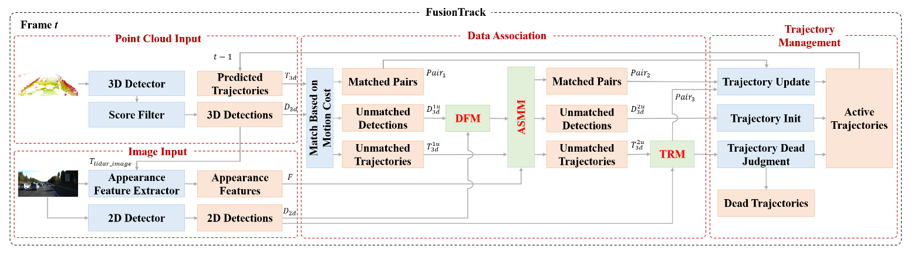

### 🎯 核心内容
- 新的融合框架：利用了相机的外貌特征。数据关联也引入融合。
- 检测滤波模块(DFM)：针对误检的情况，过去的解决方法是多检测几帧才确认追踪，这引入了延迟问题。作者将未匹配的检测投影到2D进行检查，确认是否是误匹配。
- 外观相似度匹配模块(ASMM)：二阶段数据关联引入外貌特征进行匹配。之前是用GIoU进行匹配。这个部分作者还新建了一个特征提取网络
- 轨迹恢复模块(TRM)：针对漏检的目标，作者提出了这个模块。还是使用相机的检测结果来帮助3D检测。当轨迹的预测结果投影和相机重合度高，就认为这个预测是好的，保留并且作为3D的检测结果。

### :wheelchair: 工作流程

### 💡 学习收获 
- 注意到，本文使用了外貌特征。因此，作者也使用了EMA模块来更新外貌特征。
- 本文使用的是KF-CA模型。
- 本文非常适合作为对比目标。它是IROS24年结果，并且方法也很常规，指标不算特别高。

## DiffMOT: A Real-time Diffusion-based Multiple Object Tracker with Non-linear Prediction
### 🌟 基本信息
- 开源地址：https://github.com/Kroery/DiffMOT
- 发表信息：2024 IEEE/CVF Conference on Computer Vision and Pattern Recognition (CVPR)
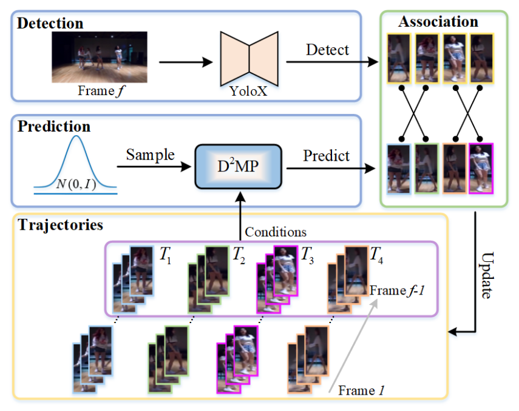

### 🎯 核心内容
多目标跟踪（MOT）在跟踪-by-检测框架中高度依赖运动预测器。主流方法大多采用近似线性的模型来做预测，但在更加复杂的场景中不适用。
文章将扩散模型引入到目标的运动预测中，提出了一个D2MP网络

## STT: Stateful Tracking with Transformers for Autonomous Driving
### 🌟 基本信息
- 未开源
- 发表信息：2024 IEEE International Conference on Robotics and Automation (ICRA)
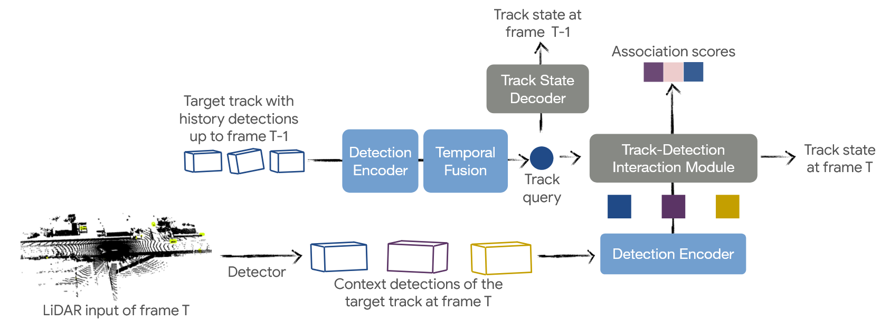

### 🎯 核心内容
- 作者设计了Encoder和Decoder将目标状态在两个空间进行转换。然后基于Transformer结构设计了TF模块，将历史的检测信息提取出query。TDI模块交叉注意力模块得到关联矩阵。随后还是进行的匈牙利算法等常规方法，但是论文中没讲。

### 💡 学习收获 
- 虽然文章整体没怎么写清楚，但是思路确实前沿，跟我的构想越细究越像。
- 由于匹配和生命周期管理都是不可微的，因此这个部分是无法参与到神经网络的反向传播的。因此两者需要分开进行训练/调参。
- 损失函数，我觉得就先采用该文章的交叉熵损失。

## Co-MOT: Exploring the Collaborative Relations in Traffic Flow for 3D Multi-Object Tracking
### 🌟 基本信息
- 未开源
- 发表信息：IEEE Transactions on Intelligent Transportation Systems ( Volume: 26, Issue: 4, April 2025)
- 其他：注意有两个简称Co-MOT的方法，为了避免混淆，这里使用Co-MOT-tits来表示，是使用GNN修正KF的方法。另一种是E2E方法。

## MambaTrack: A Multi-Modal Multi-Object Tracking Framework with a Novel Kalman Filter
### 🌟 基本信息
- 开源地址：https://github.com/JackWoo0831/Mamba_Trackers (非官方实现)
- 发表信息：ACMMM 2025

### 🎯 核心内容
- 将Mamba模块引入追踪器，取代卡尔曼滤波器从而达到更好的非线性预测效果。

### 💡 学习收获 
- 该文章仅仅添加了Mamba模块，其它都使用的SORT基本框架。但是其效果非常好，说明Mamba模块确实有很好的效果。

### 🎨 TODO
- 实现Mamba模块，并添加到SORT中。
- 具体理解Mamba原理。

## DINO-MOT: 3D Multi-Object Tracking With Visual Foundation Model for Pedestrian Re-Identification Using Visual Memory Mechanism

### 🌟 基本信息
- 开源地址：未开源
- 发表信息：RAL2025
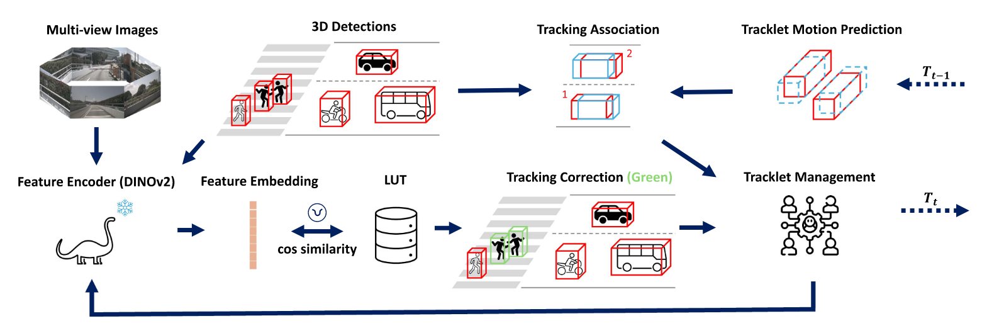

### 🎯 核心内容
- 将DINOv2特征提取器引入MOT
- 它并非采用的传统REID的方法，而是使用视觉LUT来矫正追踪的情况。
- 文章采用了两条线来完成追踪任务。主线依旧是传统的TBD框架，并且算是各方法的大成者，不同目标设置不同模型、不同参数、不同的关联矩阵和阈值。此外，另一条线就是重识别，利用LUT模块来纠正IDSW。主要思路是，如果提取到的特征和LUT库中的非常相似，那么这就是同一个目标，如果之前匹配错了此时会进行纠正。

## HybridTrack: A Hybrid Approach for Robust Multi-Object Tracking
### 🌟 基本信息
- 开源地址：https://github.com/leandro-svg/HybridTrack
- 发表信息：IEEE Robotics and Automation Letters，2025,07
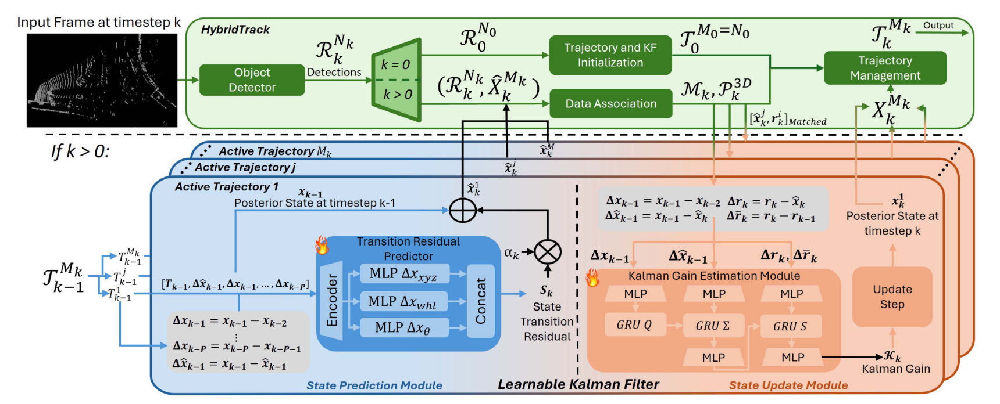

### 🎯 核心内容
- 设计了一个前端MLP网络，后端KALMANNET的新型滤波器

## RobMOT: 3D Multi-Object Tracking Enhancement Through Observational Noise and State Estimation Drift Mitigation in LiDAR Point Clouds
### 🌟 基本信息
- 开源地址：未开源
- 发表信息：TITS2025
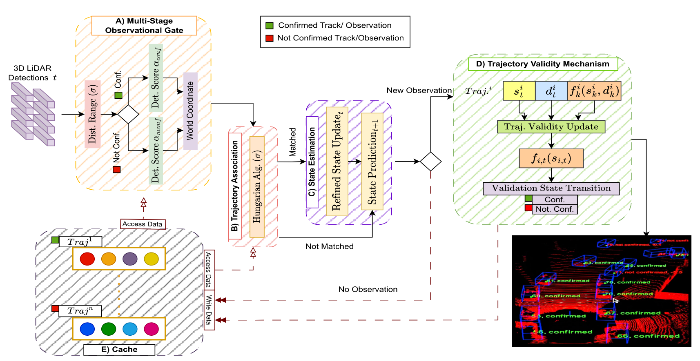

### 🎯 核心内容
- 采用了一种新的检测数据提取方式。就是更宽松了，放入一些低置信度但是也可能是真检测的结果。
- 针对每种检测器提出了一个精修的卡尔曼滤波器。经过数据统计，发现检测器的误差呈现出一个高斯分布，所以新增了一个噪声参数来进行补偿。
- 轨迹验证机制：用来消除幽灵轨迹。大致就是一个轨迹有一个评分机制，如果评分高于阈值就认定为是真实轨迹。是一种降低误检的机制。
- 提出了一种新的轨迹生命管理策略，通过协方差来决定轨迹的存活与否，通过目标的不确定度来决定是否继续跟踪。这框架确实和之前大不相同。

## Focusing on Tracks for Online Multi-Object Tracking
### 🌟 基本信息
- 开源地址：未开源
- 发表信息：2025 IEEE/CVF Conference on Computer Vision and Pattern Recognition (CVPR)

### 🎯 核心内容
本文最大的特点就是不再是过去全局优化（匈牙利算法），而是以轨迹为中心进行设计，聚焦每个轨迹的局部匹配精度和可靠初始化，适配多目标跟踪中轨迹与检测结果的强关联性。
- 数据关联：Track-Perspective-Based Association（TPA）
  - 全面使用了检测结果。本文使用到的检测结果包括 NMS后的高置信度结果、NMS后的低置信度结果、NMS排除但是置信度高的结果。如此一来，数据关联的候选集就非常丰富。然后作者的匹配方法其实是一个贪婪算法。检测和轨迹都是当前集合最优（互相）的时候认为是匹配。然后集合缩小，重复直到所有都低于阈值。
- 轨迹初始化：Track-Aware Initialization（TAI）
  - 由于检测结果的候选非常多，自然追踪器误检的情况会变多，作者就专门就此提出了一种初始化方法。其实就是一个NMS，在匹配任务完成后，围绕“匹配的轨迹”和“置信度非常高的检测”为中心做NMS，以排除误检。

### 💡 学习收获 
本文的方法也是非常的简单。我认为提点的最大原因在于检测结果收录的更多了。所有模块都是围绕这一点展开的。

## LA-MORT: LA-MOTR: End-to-End Multi-Object Tracking by Learnable Association
### 🌟 基本信息
- 开源地址：https://github.com/PenK1nG/LA-MOTR
- 发表信息：2025 IEEE/CVF Conference on Computer Vision and Pattern Recognition(CVPR)
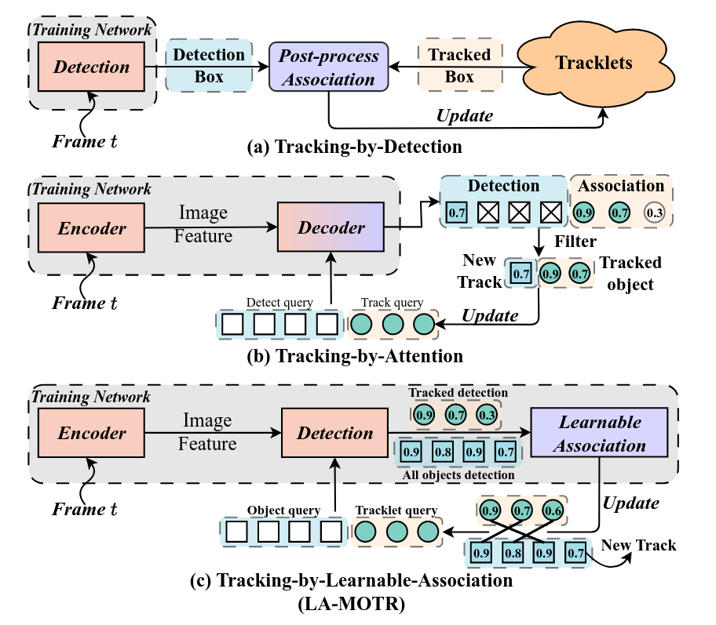

### 🎯 核心内容
- 提出了一个端到端的多目标追踪框架LA-MORT，解决了检测与关联之间的竞争问题。
- 文章认为现有的E2E方法